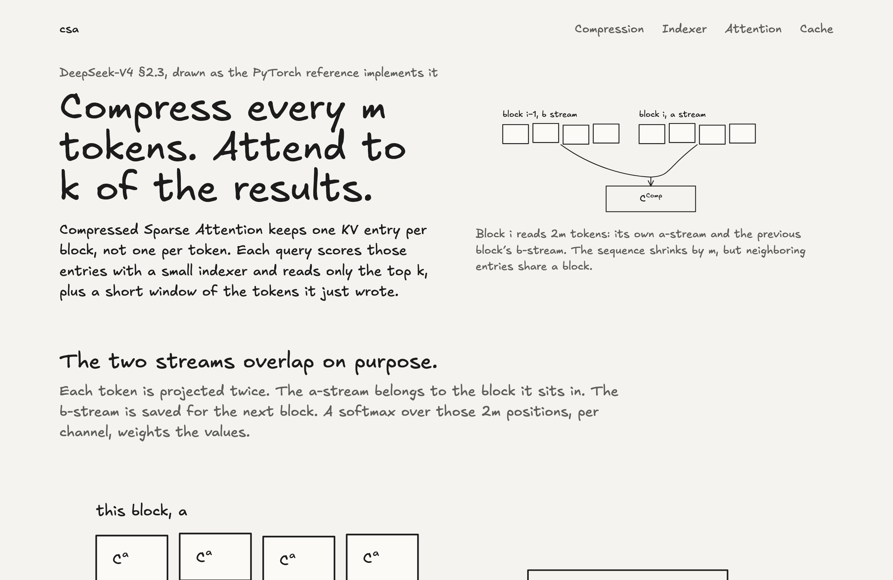

# csa-cutile

A pure-PyTorch reimplementation of **Compressed Sparse Attention** from
DeepSeek-V4 (§2.3.1 eqs. 9–19, grouped output projection, and the §2.3.3
details), pulled out of the V4 inference bundle so it can be studied, tested,
and dropped into other models.

The PyTorch code in `src/csa/reference.py` is meant to be readable, not fast.
Development is on Apple Silicon with no CUDA device, so fused Triton kernels, a
cuTile port, and long-context model demos are out of scope (resource gated). 

A walk through the diagrams is at <https://jvkec.github.io/csa-cutile/>.

[](https://jvkec.github.io/csa-cutile/)

## Install

```bash
python3 -m venv .venv
source .venv/bin/activate
pip install -e ".[dev,demo]"
```

## Demo

The walkthrough loads a small synthetic input, runs CSA on it, and writes
plots (compressed-KV heatmap, indexer scores, sparse attention pattern, KV
cache savings) to `demo/output/`.

```bash
python demo/walkthrough.py
```

## Tests and bench

```bash
pytest                                     # ~50 ms, CPU only
python bench/bench_attention.py --n 1024 --d 256 --m 16 --k 8
```

## Layout

```
src/csa/reference.py     single-sequence CSA, paper eqs. 9–19 and §2.3.3
src/csa/module.py        batched CSA module and incremental KV cache
src/csa/__init__.py      public API: CSA, CSACache, CSAConfig, CSAParams, csa_reference, random_params
tests/                   structural-invariant tests for the reference
bench/bench_attention.py mem ratio, tok/s, cosine sim vs. dense MQA
demo/walkthrough.py      v0 demo: small example + plots
docs/derivation.md       paper-to-code map
```

## References

- DeepSeek-V4 paper: <https://huggingface.co/deepseek-ai/DeepSeek-V4-Pro/blob/main/DeepSeek_V4.pdf>
- DeepSeek-V4 inference: <https://huggingface.co/deepseek-ai/DeepSeek-V4-Pro/tree/main/inference>

Apache-2.0.
